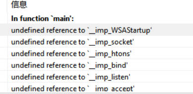
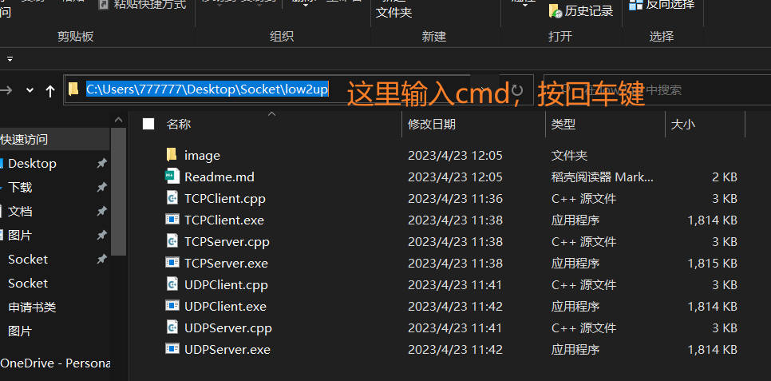
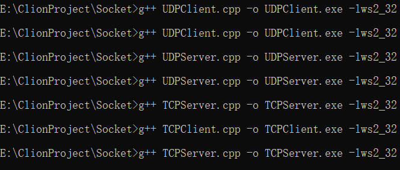
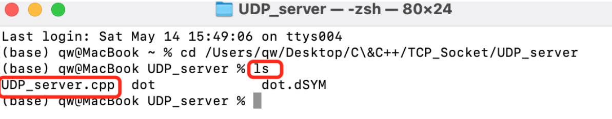

#### win出现问题

以下是针对Socket套接字编程中如下图中所示的未定义的问题(undefined reference to  imp_WSAStartup'  imp_socket'...)：




#### win解决方式

1. 首先安装g++编译器，如果没有可参考以下网页，首先在cmd（快捷键win+R打开cmd）中输入

   ```c++
   g++ -v
   ```

   查看g++版本

   **安装网页**：

   [0]: https://cloud.tencent.com/developer/article/1500352	"Windows下 gcc/g++的安装与配置"

2. 在当前目录下启用cmd，或者使用cd命令切换到对应的目录文件夹

   

3. 使用命令编译产生exe文件 

   ```C++
   g++ TCPClient.cpp -o TCPClinet.exe -lws2_32
   ```

   -o 后跟着产生exe文件的名称

   -lws2_32 是一种链接库，该库对应ws2_32.dll，提供了网络相关API的支持，若使用其中的API，则应该将ws2_32.lib加入工程。

   

4. 在文件下运行相应的exe文件（例:TCPClinet.exe）


#### mac终端运行cpp文件

1. 打开终端，输入cd 文件所在目录，是文件夹哦

   用ls查看当前目录下的文件，确实有要编译的目标.cpp文件

   

2. 编译执行

    控制台输入以下代码，注意修改你的.cpp文件名，不要真的是main.cpp

   ```c++
   gcc -Wall -g -o dot main.cpp
   ```

3. 回车输入

   ```C++
   ./dot
   ```

   ​    在没有编译错误的情况下，就可以生成dot 和 dot.dsYM文件，如上图我的那样，如果有错，说明代码有问题，或者其他问题，在CSDN上搜索 Mac如何运行C++文件，自行解决。

   ​    之后就可以享受自己和自己发消息了。

   

#### 可供参考学习网页

[1]: https://blog.csdn.net/m0_50609661/article/details/118284680	"DEVC++关于Windows-socket网络编程，需首先链接lws2_32库"
[2]: https://www.cnblogs.com/shorts-shorts-shorts/p/14122257.html	"windows socket编程入门超详细笔记之同步tcp 服务器篇"

[3]: https://blog.csdn.net/qq_51802524/article/details/124769460	"Mac用Xcode建立TCP和UDP Socket（套接字）编程"

